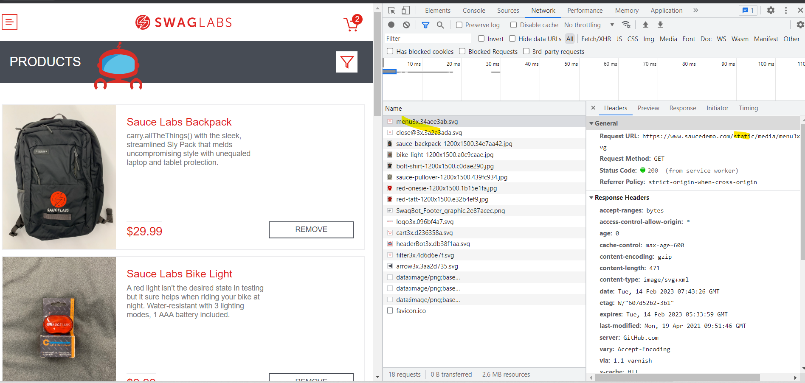
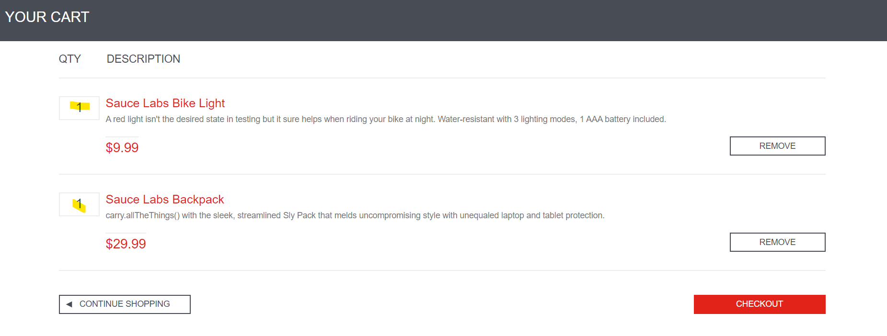
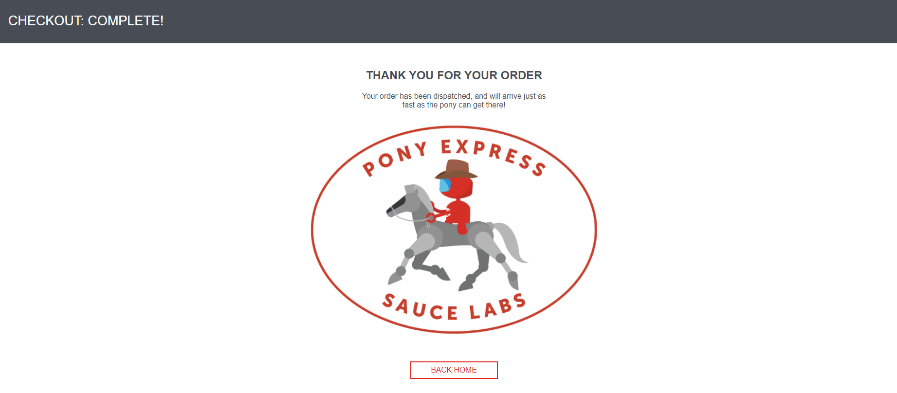

This repository is an test assessment exercise for the system: https://www.saucedemo.com/

**Author: Jude Bordallo**

**TEST CASES**

UI: validate products are complete 
Navigation: end to end lifecycle of shopping 
Functional: filtering/sorting scenarios 
Edge: caching of cart when checkout is delayed 

[label](../cloned-saucedemo/saucedemo-cypress/test_cases/Sauce%20Demo%20Test%20Cases.xlsx)

**BUGS**

See the 'known_issues.txt' for details: [bugs](bugs/known_issues.txt)

1. User cannot transact in website (problem_user)
2. Reset app state removes items from cart not updating cart realtime
3. Checkout without an item in cart 

[label](bugs/SauceDemo%20Known%20Issues%20.docx)

**Scenarios to be automate**
1. login/logout scenarios - DONE
2. shopping scenarios - DONE
3. sorting products in inventory - partially done

**Out-of-scope scenarios in automation**
1. no api connections in login and checkout

2. cannot modify quantity of added product in cart

3. validating purchase confirmation sent to customer

**INSTALLATION**
1. git clone the repository to local machines
2. npm install
3. npx cypress open 
4. run spec files
