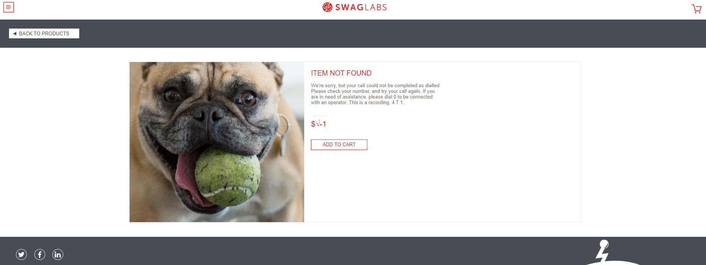
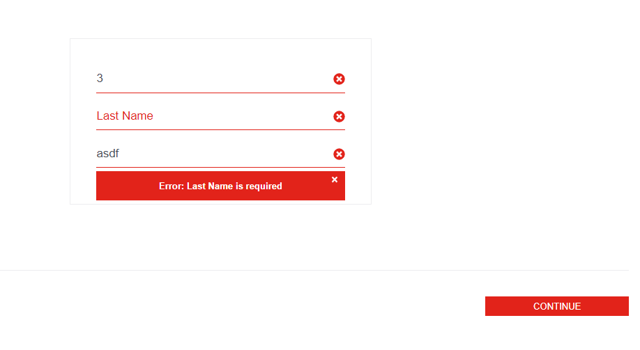
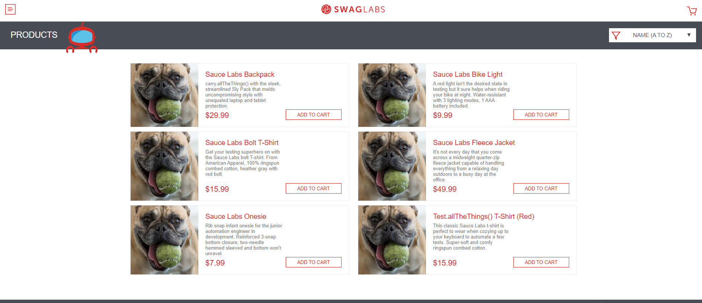
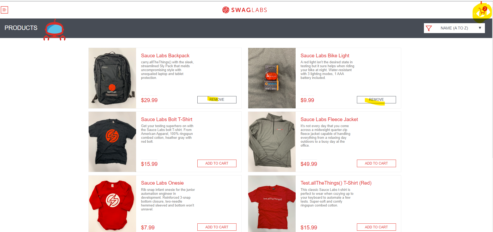
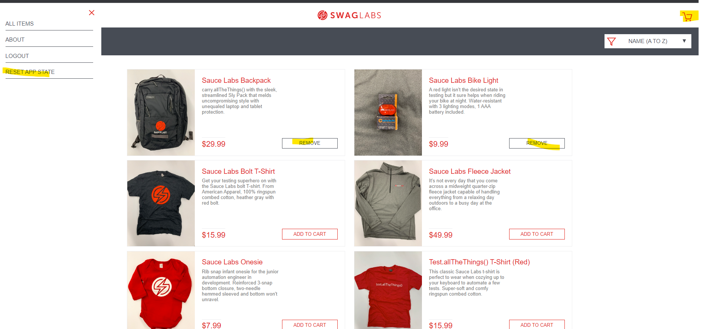
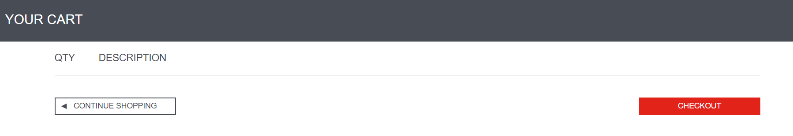
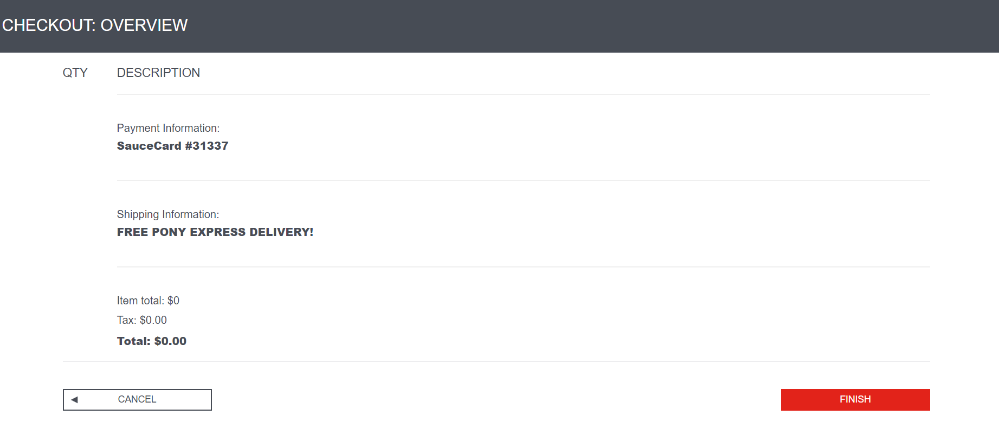

This repository is an test assessment exercise for the system under test: https://www.saucedemo.com/

*** Author: Jude Bordallo ***

*** TEST CASES ***
UI: validate products are complete

[label](test_cases/ui_test_case.txt)

Navigation: end to end lifecycle of shopping

[label](test_cases/navigation_test_case.txt)

Functional: filtering/sorting scenarios

[label](test_cases/functional_test_case.txt)

Edge: caching of cart when checkout is delayed

[label](test_cases/edge_test_case.txt)

*** Bugs discovery ***
See the 'known_issues.txt' for details: 
[label](bugs/known_issues.txt)

1. User cannot transact in website (problem_user)

2. Reset app state removes items from cart not updating cart realtime

3. Checkout without an item in cart 

*** Scenarios to be automated ***
1. login/logout scenarios - DONE
2. shopping scenarios - DONE
3. sorting products in inventory - partially done

*** Out-of-scope scenarios in automation ***
1. no api connections in login and checkout

2. cannot modify quantity of added product in cart

3. validating purchase confirmation sent to customer

*** How to install ***
1. git clone the repository to local machines
2. npm install
3. npx cypress open 
4. run spec files